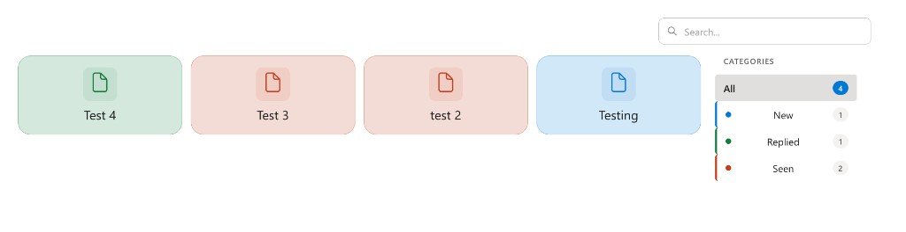
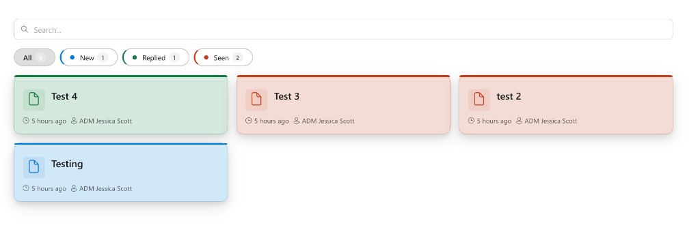
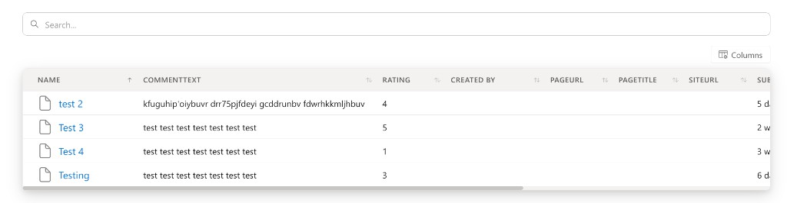

# Content Library

SharePoint Framework (SPFx) **1.20** web part that connects to any SharePoint **list** or **document library** on the tenant, using a selected **view** to drive which columns load. Authors configure everything in the **property pane**; visitors get search, optional category filters, sort controls, and several display styles without leaving the page.

---

## Screenshots

Static previews (files live under `docs/` in this repo):

<table>
<tr>
<td align="center"><strong>Tile view with category colours</strong></td>
<td align="center"><strong>Card grid with filters</strong></td>
</tr>
<tr>
<td></td>
<td></td>
</tr>
</table>

<p align="center">
  <strong>Table / list view with horizontal scroll and resizable columns</strong><br />
  
</p>

---

## What it does

- **Data**: Pick site (optional), list or library, view, and how many items to load (up to the configured limit).
- **Layouts**: Card grid, **Preview** (thumbnails + meta), table/list, tile grid, compact icon grid, and dashboard.
- **Search**: Optional bar with styles (minimal, elevated, toolbar), debounce, and configurable fields to search.
- **Filters**: Optional category filter on a Choice/Text (and similar) column; pills, vertical rail, cards, or compact buttons; position top, left, or right; optional counts and **colour coding** for categories.
- **Sorting**: Default sort presets (title, created, modified, ID) in Advanced; optional in-page sort UI; table column sorting when enabled.
- **Cards / Preview**: Two configurable **detail lines** (field + leading **icon**); **Choice** values can render as **coloured pill badges** on cards (toggle); long detail text clamps to two lines with ellipsis.
- **Lists only**: Clicking an item opens a **details modal** (not the native form) with view columns; **Choice** columns show pills in the modal. **Document libraries** open the file in the browser (same tab / new tab per setting).
- **Edit mode**: Per-item **icon** overrides; in **Preview**, custom **thumbnail** images (upload or pick from Site Assets) via PnPjs.
- **Details modal header**: Optional **thumbnail** (same source as Preview: custom URL or file preview), with layout **beside title** or **above centered title**, or **icon-only** when the toggle is off or no image exists.

---

## Requirements

| Requirement | Notes |
|-------------|--------|
| **Node.js** | `>=18.17.1 <19.0.0` (see `package.json` `engines`) — SPFx 1.20 toolchain |
| **SharePoint** | SharePoint Online |
| **Permissions** | Users need read access to the list/library and items; authors need appropriate rights to upload thumbnails to Site Assets when using that flow in edit mode |

---

## Getting started (development)

```bash
npm install
```

**Local / workbench** (typical SPFx):

```bash
gulp serve
```

**Production bundle and solution package** (for tenant App Catalog deployment):

```bash
gulp bundle --ship
gulp package-solution --ship
```

Output **`.sppkg`**: `sharepoint/solution/` (exact path is in `config/package-solution.json` under `paths.zippedPackage`).

**Versioning**: Web part package version is in `package.json`; SharePoint solution version is in `config/package-solution.json` — keep them aligned with your release process when you ship.

---

## Configuration (property pane)

Settings are grouped across **two accordion pages**:

1. **Data source & display** — Web part title, site URL, list/library, view, item limit; **Display style** group includes **Accent colour (hex)** (default `#3c6aa7`) for links, active filters, focus rings, and primary UI accents, plus layout (card / preview / table / tiles / icons / dashboard), density, grid columns, corner radius, shadows, text and icon size.
2. **Search, filters, fields & advanced** — Search bar, filter field and UI style/position, category colours, visible fields (file icon, description, table headers), **card detail lines** (fields + **icons** per line), **choice pills on cards** toggle, **details window** thumbnail toggle and layout, sort defaults and user sort / toolbar sort, link target for documents, empty state message, custom CSS class on the root.

Default configuration values and TypeScript types live in `src/webparts/contentLibrary/models/IWebPartConfig.ts` (`DEFAULT_CONFIG`).

---

## Project layout (high level)

```
config/                 # SPFx build & solution manifest (package-solution.json, etc.)
src/webparts/contentLibrary/
  ContentLibraryWebPart.ts    # Web part class, property pane, data bootstrap
  components/                 # React UI (ContentLibrary, grids, search, filters, …)
  services/                   # SharePoint REST via PnPjs (lists, views, fields, items)
  helpers/                    # Formatting, search/sort, colours, choice badges, thumbnails, …
  models/                     # Config and list/item typings
  styles/                     # SCSS modules (ContentLibrary.module.scss)
```

---

## Details window (list items)

| Setting | Location | Effect |
|---------|----------|--------|
| **Show thumbnail in details window when available** | Property pane → Visible Fields → Details window | **On**: uses `resolveItemThumbnailUrl` — custom thumbnail from overrides first, else SharePoint `getpreview.ashx` when `fileRef` exists. **Off**: header shows only the **icon** row. |
| **Thumbnail layout in details window** | Same section | **Left of title**: small 16∶9 thumbnail in one row with the title. **Above title**: image centered above a centered title with spacing. |
| **Image load error** | — | Automatically falls back to the **icon** header (with icon/colour overrides when set). |

Icons in the header use **per-item icon overrides** when the thumbnail is hidden or unavailable, otherwise the default file-type icon for the item.

---

## Document library vs list

| Mode | Click behaviour |
|------|------------------|
| **Document library** | Opens the file URL (`linkTarget`: same tab or new tab). No details modal. |
| **List** | Opens the **details modal** with fields from the view (plus modified metadata in the footer when present). |

---

## Stack

- **React** 17, **TypeScript** 4.7, **Fluent UI** React 8  
- **@pnp/sp** v3, **@pnp/spfx-controls-react** (e.g. FilePicker for thumbnails)  
- **date-fns** for dates  

---

## Repository remote

If GitHub reports that the repository has moved:

```bash
git remote set-url origin https://github.com/j-scott-hg/spfx-content-library.git
```

---

## Licence

Use your organisation’s licence for this codebase if no `LICENSE` file is present in the repository.
